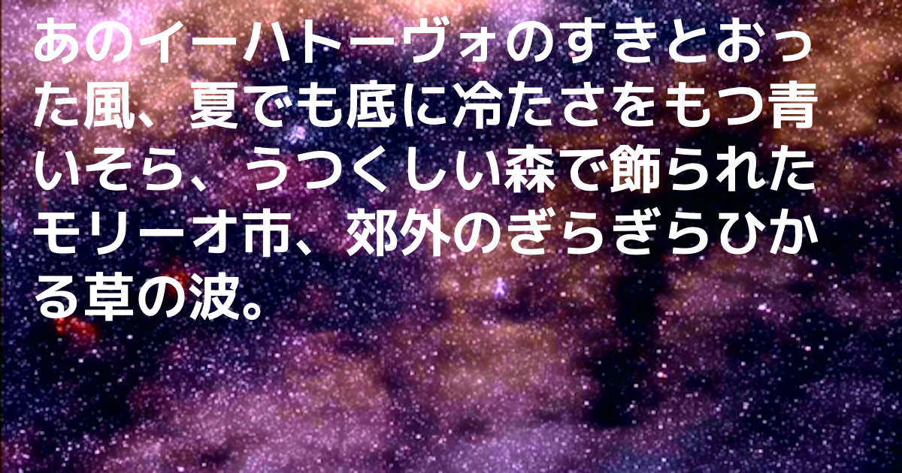

# mkimg

Create image with text from CLI

### Installation

```
go get -u github.com/achiku/mkimg
```

### How to use

```
Usage of ./mkimg:
  -debug
        debug output
  -fontfile string
        ttf font file path
  -fontsize float
        font size (default 100)
  -height int
        image height (default 630)
  -outfile string
        output image path (default "out.png")
  -space
        space image
  -txt string
        text to image (default "hello, world!")
  -width int
        image width (default 1200)
```

```
mkimg -txt="それは本当にそう" -fontfile=./Koruri-Bold.ttf
```


```
mkimg -fontfile=./Koruri-Bold.ttf -fontsize=70 -outfile=out.png -space -txt="あのイーハトーヴォのすきとおった風、夏でも底に冷たさをもつ青いそら、うつくしい森で飾られたモリーオ市、郊外のぎらぎらひかる草の波。"
```


